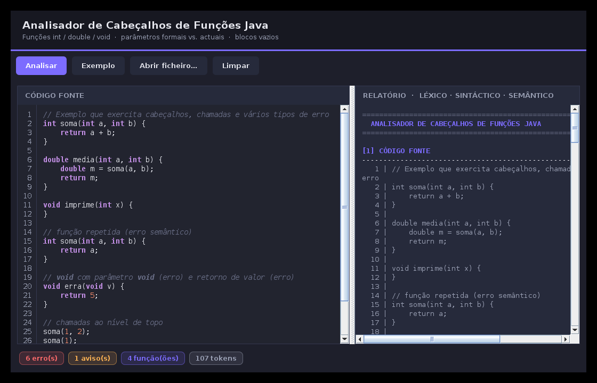
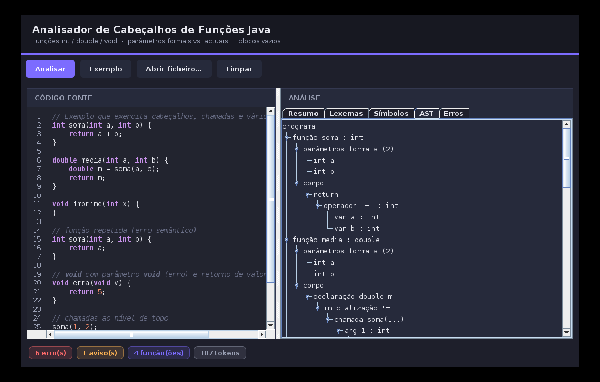
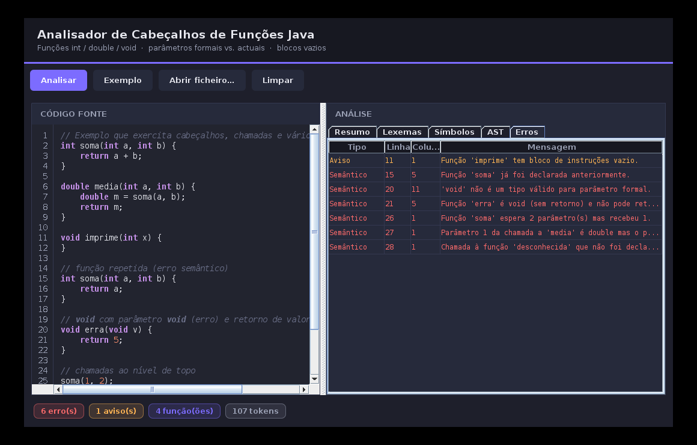

# Analisador de Cabeçalhos de Funções Java

Front-end de compilador escrito à mão (sem geradores), numa **única classe
Java**, que faz por fases a análise **Léxica → Sintáctica → Semântica** de um
subconjunto de Java centrado em **cabeçalhos de funções**.

Segue a mesma lógica do projecto
[analisador-switch-java](https://github.com/ClesioJuma/analisador-switch-java):
acumula **todos** os erros de todas as fases (não pára no primeiro) e no fim
imprime quatro quadros — código fonte numerado, tabela de lexemas, tabela de
símbolos e lista de erros/avisos ordenada por linha.

## O que analisa

- **Cabeçalhos de funções** de tipo `int`, `double` ou `void` (sem retorno).
- **Parâmetros formais** (na declaração): tipo válido (`int`/`double`), nome, e
  detecção de nomes repetidos.
- **Chamadas de funções** com validação dos **parâmetros actuais (reais)**
  contra os **parâmetros formais**: número de argumentos e compatibilidade de
  tipos (permite alargamento `int → double`, proíbe estreitamento `double → int`).
- **Funções com blocos de instruções vazios** (assinaladas como aviso).
- Chamadas encadeadas (o resultado de uma função como parâmetro de outra).

## Erros tratados

| Fase | Exemplos |
|------|----------|
| **Léxica** | caractere inválido, número real mal formado (`3.`), comentário de bloco não terminado |
| **Sintáctica** | falta de `(`, `)`, `{`, `}`, `;`, tipo de parâmetro em falta, instrução inválida (com recuperação de erro e sincronização) |
| **Semântica** | função duplicada, chamada a função não declarada, número de parâmetros errado, tipo de parâmetro actual incompatível, `void` como tipo de parâmetro/variável, `return` com valor numa função `void`, função `int`/`double` sem `return`, uso de identificador não declarado, função `void` usada em expressão |

## Como executar

```bash
javac AnalisadorCabecalhosFuncoes.java

# Analisar um ficheiro
java AnalisadorCabecalhosFuncoes exemplos/valido.txt
java AnalisadorCabecalhosFuncoes exemplos/com_erros.txt

# Sem argumento: analisa um exemplo embutido que exercita todos os erros
java AnalisadorCabecalhosFuncoes
```

Se o terminal não estiver em UTF-8, force a codificação da saída:

```bash
java -Dstdout.encoding=UTF-8 AnalisadorCabecalhosFuncoes exemplos/com_erros.txt
```

O programa devolve código de saída `1` quando há erros (avisos não contam).

## Interface gráfica (Swing)

Além do modo consola, há uma interface gráfica desktop em Java puro (Swing,
sem dependências). Escreve-se ou cola-se o código à esquerda e o relatório
das quatro fases aparece à direita, com uma barra de estado que indica se
houve erros.

```bash
javac AnalisadorCabecalhosFuncoes.java
java AnalisadorCabecalhosFuncoes --gui
```

Botões: **Analisar**, **Exemplo** (carrega o exemplo embutido), **Abrir
ficheiro…** e **Limpar**. A análise corre automaticamente enquanto se escreve.

O painel de resultados está organizado em abas:

- **Resumo** — o relatório completo das quatro fases, com secções e
  erros/avisos a cores.
- **Lexemas** — tabela de tokens (lexema, classe, linha, coluna).
- **Símbolos** — tabela das funções (retorno, nº de parâmetros, se o bloco
  é vazio e os parâmetros formais).
- **AST** — a árvore sintáctica abstracta (funções, parâmetros, corpo,
  instruções e expressões com o respectivo tipo).
- **Erros** — tabela com o **tipo** do erro (Léxico / Sintáctico /
  Semântico / Aviso), **linha**, **coluna** e mensagem, com as linhas a
  vermelho (erro) ou laranja (aviso).







## Gramática reconhecida (EBNF)

```
programa   -> { funcao | chamadaTopo }
funcao     -> tipoRet IDENT '(' formais ')' bloco
tipoRet    -> 'int' | 'double' | 'void'
formais    -> [ formal { ',' formal } ]
formal     -> tipoParam IDENT
tipoParam  -> 'int' | 'double'
bloco      -> '{' { instrucao } '}'
instrucao  -> declVar | atribuicao | retorno | chamada ';'
declVar    -> tipoParam IDENT [ '=' expr ] ';'
atribuicao -> IDENT '=' expr ';'
retorno    -> 'return' [ expr ] ';'
chamada    -> IDENT '(' actuais ')'
actuais    -> [ expr { ',' expr } ]
expr       -> termo { ('+'|'-'|'*'|'/') termo }
termo      -> NUMERO_INT | NUMERO_REAL | chamada | IDENT | '(' expr ')'
```

## Estrutura interna (tudo numa classe)

Classes internas dentro de `AnalisadorCabecalhosFuncoes`:

- `Lexer` / `Token` / `ClasseToken` — análise léxica
- `Parser` — análise sintáctica descendente recursiva + semântica
- `TabelaSimbolos` / `Funcao` / `Parametro` — tabela de símbolos
- `ColetorErros` / `Erro` / `Fase` — recolha unificada de erros e avisos
- `Tipo` — sistema de tipos (`int`, `double`, `void`) e regras de compatibilidade
- `gerarRelatorio(...)` / `analisar(...)` — produzem os quatro quadros como texto reutilizável
- `AnalisadorGUI` — interface gráfica Swing (opcional, `--gui`)
